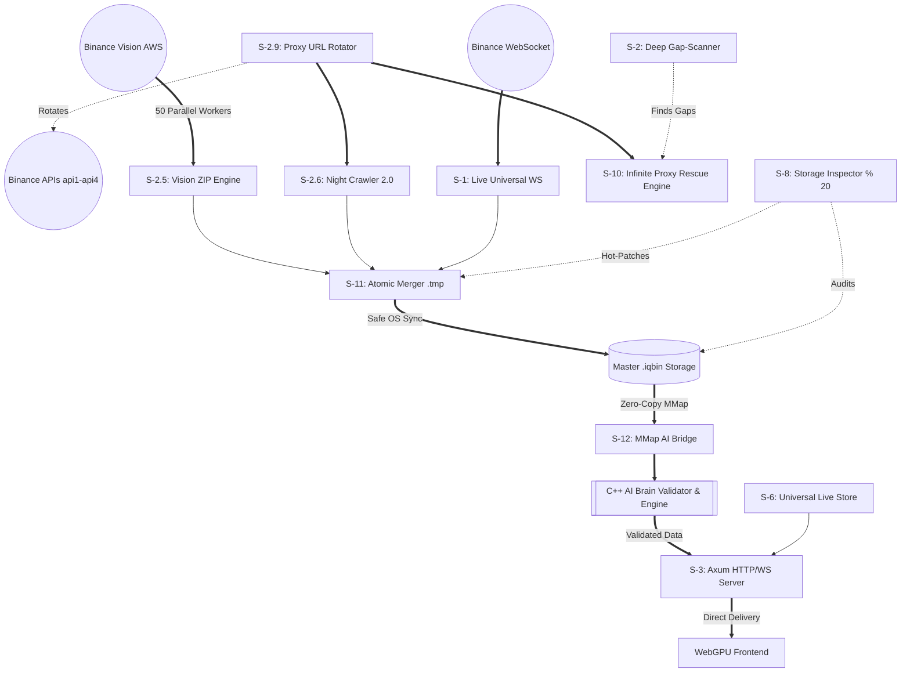

# 🚀 QUANTA AI - MASTER ARCHITECTURE BLUEPRINT

Bhai, this roadmap is the core blueprint. **Any AI or Human working on this project MUST strictly follow this architecture.** 
The ultimate goal is simple: **100% Data Integrity, Zero Gaps, Zero Corruption, and Sub-Millisecond AI latency.**

---

## ⚙️ The Omni-Engine (All Services)

### 📥 1. The Core Intake (Data Ingestion)
- **[Service 1: Live Universal WebSocket]**: Pulls real-time tick-by-tick data from Binance across all 1,000+ pairs in milliseconds.
- **[Service 2.5: Vision ZIP Engine]**: Uses a 50-worker parallel downloader connected to AWS `data.binance.vision` to fetch years of bulk ZIP data quickly.
- **[Service 2.6: Night Crawler 2.0]**: Uses the Binance REST API (`api1`, `api2`, `api3`, `api4`) to perform slow historical scraping where ZIP files fail.

### 🛡️ 2. The Shield & Scanners (Proxy & Gap Detection)
- **[Service 2.9: Proxy Engine (URL Rotator)]**: Dynamically rotates between `api.binance.com`, `api1`, `api2`, `api3`, and `api4` to completely evade TLS/IP bans.
- **[Service 2: Deep Gap-Scanner]**: Runs mathematically to identify missing timestamps and missing candles. **Rule: No Gaps Allowed.**
- **[Service 10: Persistent Proxy Rescue Engine]**: An infinite loop wrapped around the proxy fetcher. If a proxy fails, it instantly swaps and retries endlessly until the data is secured.

### ⚡ 3. The Live Caching (Low-RAM State)
- **[Service 6: Universal Proxy Live Store]**: Maintains the live state of all pairs to prevent redundant REST API calls.
- **[Service 2.8: Ticker Proxy]**: Caches the 24-hour ticker data for instant frontend loading.

### 🩺 4. The Healers & Storage (Zero Corruption)
- **[Service 8: Storage Inspector (Size % 20)]**: Checks every binary file size modulo 20 to guarantee absolute structural integrity. Performs "Smart Hot-Patch" truncation if corruption is detected.
- **[Service 9: Smart ZIP Hot-Patch Engine]**: If Service 8 finds corruption, this engine patches it.
- **[Service 11: Direct-Disk Atomic Merger]**: Uses `.tmp` atomic writing and `file.sync_all()` to write data straight to the hard drive. **Rule: Even if power fails, data must not corrupt.**

### 🧠 5. The Future Intelligence (The AI Brain)
- **[Service 12: Quanta AI MMap Bridge]**: Creates a placeholder `ai_live_feed.mmap` (1MB ring buffer) on startup.
- **[Service 13: C++ Brain Validator]**: The C++ Inference Engine (`AIEngine.cpp`) will connect to the MMap Bridge and mathematically validate data integrity *before* it ever reaches the user. This guarantees the highest quality of High-Frequency Trading (HFT) and Machine Learning (ML) data.

### 📤 6. The Output (Frontend Delivery)
- **[Service 3: HTTP REST & WS Server]**: Axum server on Port `8080` sending GZIP compressed binary/JSON data to the WebGPU UI.

---

## 🗺️ Master Execution Flow Graph

