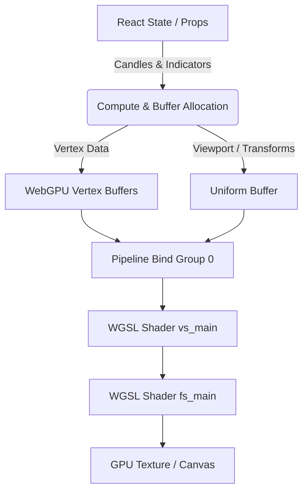

# Ultimate WebGPU Canvas Charting Engine Blueprint

This blueprint outlines the architecture, rules, and guidelines for the zero-compromise, ultra-optimized WebGPU Charting Engine. To achieve the absolute maximum speed and institutional-grade performance, the WebGPU implementation relies entirely on native APIs and hardware-level optimizations without any external Canvas/WebGL wrapper libraries.

---

## 🛑 MANDATORY AGENT RULES

> [!IMPORTANT]
> **RULE 1: MANDATORY READING BEFORE CODING**
> Any developer or agent working on, refactoring, or optimizing the WebGPU components (including [WebGPUChartEngine.jsx](file:///c:/Users/satya/OneDrive/Documents/Desktop/satyam/src_demo/components/WebGPUChartEngine.jsx)) **MUST read this blueprint file in its entirety** before changing a single line of code.

> [!IMPORTANT]
> **RULE 2: AUTOMATIC CONCEPT & IDEA SYNC**
> If any agent discusses, designs, or plans any changes, extensions, or new features for the WebGPU Canvas, all architectural concepts, decisions, and ideas **MUST be automatically saved and appended to this blueprint** to ensure context is never lost across sessions.

---

## 📐 WebGPU Architecture Overview

The WebGPU Engine (`WebGPUChartEngine.jsx`) uses WebGPU's modern pipelines, bind groups, and WGSL shaders to render institutional-grade charting elements (candlesticks, wicks, grid lines, volume bars, drawings, and indicator lines) with near-zero CPU overhead.



### 1. Zero-Dependency Native Abstraction
- **No Wrappers**: Under no circumstances should Pixi.js, Three.js, or any WebGL wrappers be introduced to the WebGPU rendering pipeline.
- **Raw WebGPU**: Use native `navigator.gpu`, `GPUDevice`, `GPUBuffer`, `GPURenderPipeline`, and `GPUBindGroup` objects directly.

### 2. Coordinate System & Math
To render data points on the screen, prices and timestamps must be converted into WebGPU clip space coordinates (ranging from `-1.0` to `+1.0` on both X and Y axes).
- **Time/Index mapping**: Time coordinates are mapped to indices to support linear rendering of candles.
- **Price scaling**: Prices are scaled dynamically based on the current minimum and maximum visible prices (considering auto-scaling and logarithmic configurations).
- **WGSL Clip Space Conversion**:
```wgsl
// Convert from pixel space to WebGPU clip space (-1 to 1)
let pos = uniforms.transform * vec3<f32>(in.position, 1.0);
out.position = vec4<f32>(
  (pos.x / uniforms.resolution.x) * 2.0 - 1.0,
  1.0 - (pos.y / uniforms.resolution.y) * 2.0,
  0.0,
  1.0
);
```

### 3. Pipeline Configurations
- **Shader Module**: A single unified WGSL shader module contains the vertex shader (`vs_main`) and fragment shader (`fs_main`) to keep context switching minimal.
- **Uniforms**: Contains a 3x3 transformation matrix, current resolution, and alignment padding to handle scale/translate shifts dynamically on the GPU.

---

## 🛠️ Planned Enhancements & Discussion Log
*Any future discussion, design patterns, or new drawing/indicator layout features related to WebGPU must be logged in this section.*

### 💬 Discussion (2026-07-20): How to build the WebGPU Canvas Charting Engine
1. **Dynamic Vertex Buffers for Real-time Streaming**:
   - Instead of recreating buffers on every frame, use a pre-allocated **Ring Buffer** (or pre-allocated large vertex buffer) and write updates using `device.queue.writeBuffer`. Only the latest candle changes will be sent over the PCIe bus, saving memory bandwidth.
2. **Line Triangulation (Custom Thickness)**:
   - WebGPU native lines are limited to 1px thickness on most hardware. To render professional trendlines (1px to 4px thickness), we must generate quads (2 triangles) dynamically using GPU vertex shader calculations or pre-calculating the geometry on the CPU.
3. **100% Pure WebGPU Text Rendering (No HTML Fallbacks)**:
   - To maintain a strict zero-dependency and ultimate performance architecture, **NO HTML or Canvas 2D overlays** will be used for text (axis labels, prices, legends).
   - Despite the extreme difficulty, text will be rendered natively within WebGPU using a **Texture Atlas (Glyph Cache)** or **Multi-channel Signed Distance Fields (MSDF)**. This ensures the entire chart, including all typography, is processed natively on the GPU pipeline for unmatched speed and consistency.
4. **Alpha Blending for Volume Profiles & Channel Fills**:
   - Configure alpha blending in the pipeline targets:
     ```javascript
     blend: {
       color: { srcFactor: 'src-alpha', dstFactor: 'one-minus-src-alpha', operation: 'add' },
       alpha: { srcFactor: 'one', dstFactor: 'one-minus-src-alpha', operation: 'add' }
     }
     ```
     This allows rendering semi-transparent volume profile histograms and Bollinger Bands fill channels smoothly.

- **Future Idea - Shader-based Indicators**: Offloading indicator calculations (e.g. Bollinger Bands, EMA) directly into WebGPU Compute Shaders.
- **Future Idea - Dynamic Vertex Batching**: Reusing vertex buffers for static historical candles and only updating the vertex buffer of the active/live candle to save memory bandwidth.

---

## 🚀 Execution Roadmap (Phase 1 to 5)
*Documented on 2026-07-20*

### Phase 1: Core GPU Setup (The Foundation)
- **GPU Adapter & Context**: Request `navigator.gpu` device and configure the canvas context to `bgra8unorm`.
- **Uniform Buffer (The Camera)**: Maintain a buffer containing "Zoom Level" and "Pan (Scroll) Offset" so the GPU can scale and translate vertices natively without CPU recalculations.

### Phase 2: Data Packing & Memory (CPU ➡️ GPU)
- **Float32 Arrays**: Pack all historical financial data (Candles, Volume) into a single `Float32Array`: `[Time, Open, High, Low, Close, Volume]`.
- **Smart Updates**: Use `device.queue.writeBuffer()` to overwrite only the last few bytes for live ticks, achieving 0-latency data transfer without reallocating the entire buffer.

### Phase 3: The Shaders (WGSL) - Main Engine
- **Candlestick Generation (Instancing)**: Draw a quad for the Body and a quad for the Wick. The Vertex Shader `vs_main` automatically calculates their positions.
- **Thick Lines (Indicators & Trendlines)**: Overcome WebGPU's 1-pixel line limit using "Quad Expansion". Pass line start and end positions, and let the GPU convert them into rectangles of any pixel thickness (e.g., 2px or 4px).

### Phase 4: The Boss Level - 100% Native Text Rendering
- **Texture Atlas (Glyph Cache)**: Generate an invisible image containing all A-Z and 0-9 characters and send it to GPU memory as a `GPUTexture`.
- **MSDF (Multi-channel Signed Distance Field)**: Draw quads for each digit on the Y-axis/X-axis and map them to the Texture Atlas. The MSDF shader guarantees razor-sharp text scaling without pixelation, eliminating the need for any HTML fallbacks.

### Phase 5: Interactions (Pan, Zoom, Crosshair)
- **CPU Events**: Track mouse interactions exclusively on the CPU.
- **Instant Rendering**: Mouse wheel scroll simply updates the "Scale Uniform", triggering an instant 144+ FPS re-render of the entire chart.
- **Crosshair**: Render native vertical and horizontal WebGPU lines based on the pointer, with MSDF Text Engine drawing the exact price and time at the edges.

### Phase 6: Zero-Dependency Line & Grid Architecture
*To avoid Pixi.js, LightningChart, or HTML Canvas wrappers, horizontal/vertical lines are computed mathematically.*
- **Grid Lines (Fragment Shader Math)**: Instead of passing thousands of grid vertices, the Fragment Shader computes grid intersections on the fly. If `pixel.y % grid_spacing < thickness`, it colors it as a grid line. 0 memory cost, infinite zoom.
- **Crosshair Tracking**: Mouse `[X, Y]` is passed to the shader as a Uniform. If a pixel's X or Y matches the mouse coordinate, it paints the Crosshair instantly on the GPU.
- **Drawing Tools (Trendlines, Horizontal Rays)**: Stored as mathematical pairs `[startX, startY, endX, endY]` in a Storage Buffer. We use **Instanced Quads** to connect them, allowing variable thickness and rotation natively in WGSL without 1px line limitations.
